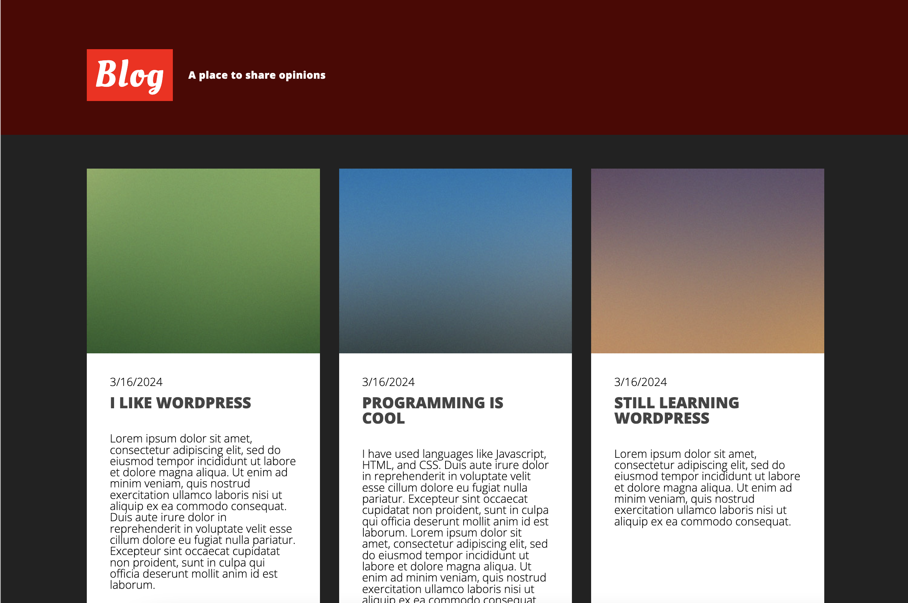

See the application here: https://ruby-rails-blog.fly.dev/

<strong>

Homepage screenshot (development environment)
</strong>

<strong>

Homepage screenshot (production environment)
</strong>

<strong>

Project Description
</strong>

I made a full stack rails application. I used a template for the frontend. I used plain javascript html and css for the frontend. I could have used a framework but i didn't. The frontend is responsive for mobile and desktop devices. I deployed the application using fly.io. The process was super easy. The application follows the MVC pattern. There is also a way to serve json and a way to make the application a "REST api" that I was looking into. I had a lot of fun making the frontend and tweaking the CSS to my liking. 
<strong>

Problems I faced
</strong>

There was a problem loading images from my development environment and production environment.
<strong>

Timeline
</strong>

I built the full stack application in 2 days. Knowing the ruby programming language and the MVC framework like Express helped me pick up Rails quickly. I did learn lots of Ruby in college and the Odin Project.

